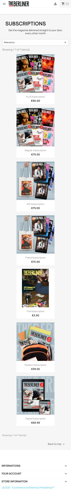
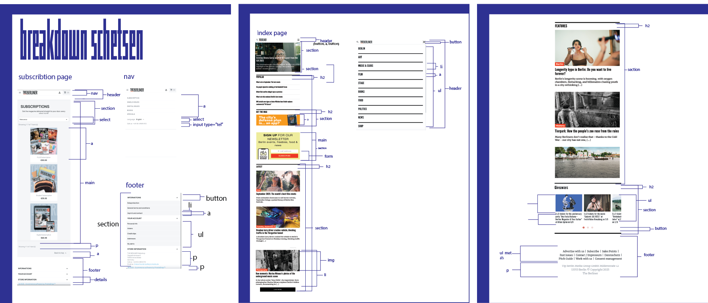
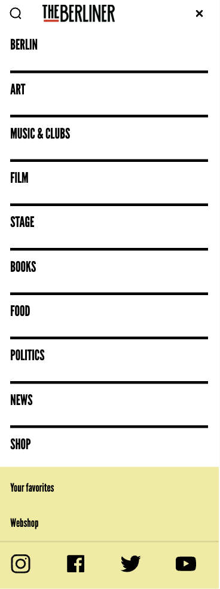
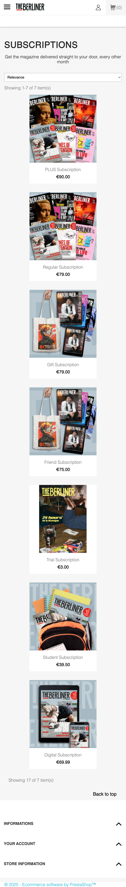
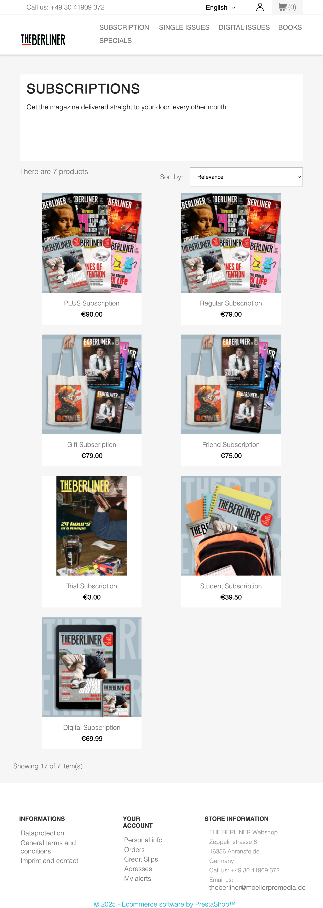
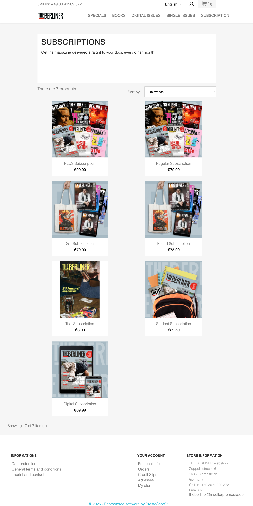
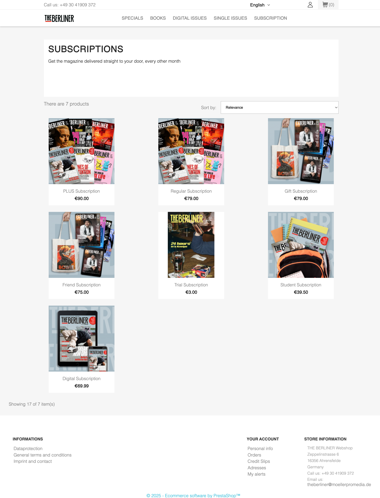

# Procesverslag
Markdown is een simpele manier om HTML te schrijven.  
Markdown cheat cheet: [Hulp bij het schrijven van Markdown](https://github.com/adam-p/markdown-here/wiki/Markdown-Cheatsheet).

Nb. De standaardstructuur en de spartaanse opmaak van de README.md zijn helemaal prima. Het gaat om de inhoud van je procesverslag. Besteedt de tijd voor pracht en praal aan je website.

Nb. Door *open* toe te voegen aan een *details* element kun je deze standaard open zetten. Fijn om dat steeds voor de relevante stuk(ken) te doen.

## Jij

  
uitwerken voor kick-off werkgroep

  ### Auteur:
  Rosalie Groen

  #### Je startniveau:
  Blauw

  #### Je focus:
  responsive
 

## Je website

  
uitwerken voor kick-off werkgroep

  ### Je opdracht:
  https://www.the-berliner.com/
  https://shop.exberliner.com/en/3-subscriptions

  #### Screenshot(s) van de eerste pagina (small screen): 
  

  #### Screenshot(s) van de tweede pagina (small screen):
  subscribe 
  
 

## Toegankelijkheidstest 1/2 (week 1)

  
uitwerken na test in 2e werkgroep

  ### Bevindingen
  Global code: er zijn geen pagina titels en er is bijna alleen maar inline coding

  Keyboard:de focus style is soms onzichtbaar of heeft hele onduidelijke stippellijntjes 
  in plaats van een duidelijke omlijning. De keyboard focus matched totaal niet de visuele layout. opgegeven moment gaat de focus halverwege de pagina naar de browser tabs.

  Moible and touch: De website kan op de telefoon niet horizontaal worden geroteerd. Dan staan
  er onderdelen over elkaar heen en zijn er rare lege ruimtes. Bij de navbar zijn de mens en zoekknop best klein.

  Headings: Bijna alles is met scripts en divs geschreven dus dat is moeilijk om te zeggen.
  er zijn in ieder geval geen logische volgordes wanneer je door de headings tabt.

  Lists: alleen scripts en divs

  Images:geen alt attributes geen alternatieve text voor meer gecompliceerde images (er is een image waarin text staat in een klein     telefoontje op de homepage en dat kan je nu dus niet lezen als persoon met zichtsbeperking). 
  
  Media(video en audio):bevatten mijn paginas niet

  Controls: a element wordt niet voor links gebruikt. buttons hebben geen focus states, button element wordt niet alleen voor buttons gebruikt. 

  Appearance: Dark en light mode doen het alleen op de homepage. subscriptions heeft geen darkmode.

  Animation: animaties zijn rustig en klein(knopjes die een kwartslag draaien als je klikt etc)

  Color contrast: goed contrast op de website. 
  

## Breakdownschets (week 1)

  
uitwerken na afloop 3e werkgroep

  ### homepage en subscription breakdown: 
  

## Voortgang 1 (week 2)

  
uitwerken voor 1e voortgang

  ### Stand van zaken
  Al veel html geschreven voor de homepage en ben bezig met de css.

  ### Agenda voor meeting

  vragen over menu,grid en feedback op code
  

  ### Verslag van meeting
  hier na afloop snel de uitkomsten van de meeting vastleggen

  De feedback was dat ik goed op weg was maar na naar mijn html opzet te hebben gekeken
  heb ik het advies gekregen om het bovenste artikel en wat andere onderdelen uit de header te halen. Qua opzet dacht ik dat dat ook in de header moest. Het was logischer in de main.

## Voortgang 2 (week 3)

  
uitwerken voor 2e voortgang

  ### Stand van zaken
  tweede pagina ook opgestelt en css van homepagina aan het afronden. Nog moeite met responsive maken.

  ### Agenda voor meeting

  vragen:
  - Hoe maak ik het signupform op de homepage responsive
  - Moeten er ook links en rechts pijlen bij carrousel? (er zijn al bolletjes er onder)
  - De "sub" menubar (geel) moet links en losbreken van het uitklapmenu wanneer het scherm groter wordt. 

  ### Verslag van meeting
  hier na afloop snel de uitkomsten van de meeting vastleggen

  uitkomsten
  - grid gebruiken om onderdelen responsive te maken
  - De pijlen moeten er ook bij en dit kan ik met mediaquerys zichtbaar en onzichtbaar maken
  - Dit kan ik positioneren door of met grid of position relative/absolute te gebruiken.

## Toegankelijkheidstest 2/2 (week 4)

  
uitwerken na test in 9e werkgroep

  ### Bevindingen
  Content: dit was al in orde:)
  
  Global code: Ik heb de pagina's van titels voorzien en de html gevalideerd. Na de validatie kwam ik er achter dat sommige sections beter divs konden worden.
  
  Keyboard:Focus style is duidelijk en de volgorde is logisch
  
  Mobile and toch: knoppen iets groter gemaakt waardoor alles makkeljk aan te klikken is.
  Een van de breaking points 768px misde ook op de echte homepage wat voor een hele rare tussenpagina zorgde en het is dus niet op de ipad te bekijken. Deze heb ik er bij verzonnen.

  Headings: Duidelijke heading titels. Bij sommige sections heb ik geen titels maar het zijn wel duidelijk van elkaar te onderscheiden stukken content. Ze zouden als div's ook niet kloppen.

  Lists: Ik heb veel gebruik gemaakt van ul's

  Images: alt text bij alle images en ook alt text voor images waar text in staat(het telefoontje bij subscribe op de homepage)

  Controls:buttons hebben aria-labels a elementen worden gebruikt voor links. niet alle buttons hebben een focus state

  Appearance: Dark en lightmode zijn gemaakt en er is hoog contrast.

  Animation: enige animations die ik had gebruikt zijn subtiel. Ik had sowieso responsive gekozen dus mijn animaties zijn minimaal.

  color contrast:kleine schaduw toegevoegd aan de text van het main artikel want anders is het moeilijk leesbaar. 
 

## Voortgang 3 (week 4)

  
uitwerken voor 3e voortgang

  ### Stand van zaken
  bijna klaar met beide pagina's. Heel veel gespeeld met grid en de pagina's grotendeels responsive gemaakt. Tijdens de lessen ook gevraagd hoe ik de footer van subscriptions responsive kon maken. Het zijn detail tags en die standaard styling tegengaan wanneer het scherm groter wordt is heel moeilijk. Ik heb het advies gekregen om ze met javascript te laten open en dichtklappen omdat ik de layout van de footer anders kan maken met groot scherm dan.
  
  ### Agenda voor meeting

  vragen:
  - De .hoofdgrid (bovenste gedeelte op de homepage) is moeilijk vorm te geven omdat alles mee lijkt te bewegen (verticaal) als ik het scherm kleiner en groter maakt. Hoe zorg ik dat alles op zijn plek blijft?
  - Ik had ook nog de vraag of er ook een darkmode moest want dit was ik even vergeten.
  - Animaties??

  ### Verslag van meeting
  hier na afloop snel de uitkomsten van de meeting vastleggen

  uitkomsten
  - Volgens Ivo zag het er goed genoeg uit en zijn dat kleine details. Het is responsive geworden
    en ik begrijp grid beter door er mee te hebben moeten werken en dat is te zien.
  - Ja er moet een darkmode bij beide sites maar dit is heel makkelijk te doen met mediaquerys 
    en is helemaal niet zo uitdagend als ik dacht.
  - De animaties zijn niet mijn prioriteit aangezien ik responsive heb gekozen. Ik heb al best wat
    javascript en dat is al best wat uitdaging. Mocht ik achteraf nog tijd hebben dan kan ik de animaties toevoegen.

## Eindgesprek (week 5)

  
uitwerken voor eindgesprek

  ### Je uitkomst - karakteristiek screenshots:
  
  
  
  
  

  
  
  

  
   
      
            

  ### Dit ging goed/Heb ik geleerd: 
  Wat ik vooral heb meegenomen uit het maken van deze website is het werken met grid en @media. 
  Ik denk dat ik hierbij verder ben gekomen dan dat ik dacht dat ik zou komen en heb toch dat best ingewikkelde menu weten te fixen. Het menu op de homepage splitst zich wanneer het scherm groter wordt.

  ### Dit was lastig/Is niet gelukt:
  wat niet is gelukt is het veranderen van het derberliner logo tijdens dark en lightmode. Dit was geen svg maar een img. Ik wou bij darkmode de source veranderen naar de witte letters maar dit ging best moeizaam en opgegeven moment moest ik de keuze maken om mijn prioriteit ergens anders te laten. 
  
  Ook was dit een probleem bij sommige svg's. Bijvoorbeeld bij de socials wouden de svg's niet veranderen.

## Bronnenlijst

  
continu bijhouden terwijl je werkt

  1. Chatgpt
  2. https://www.svgrepo.com/ voor iconen die interacteren met mediaquery
  3. https://www.the-berliner.com voor images homepage
  4. https://shop.exberliner.com/en/3-subscriptions voor images subscriptions
  5. https://www.flaticon.com/authors/prosymbols-premium iconen die niet uit maakten voor darkmode
  6. https://cssgrid-generator.netlify.app/ om grid te genereren
  7. code dlo opdracht responsive hamburgermenu

